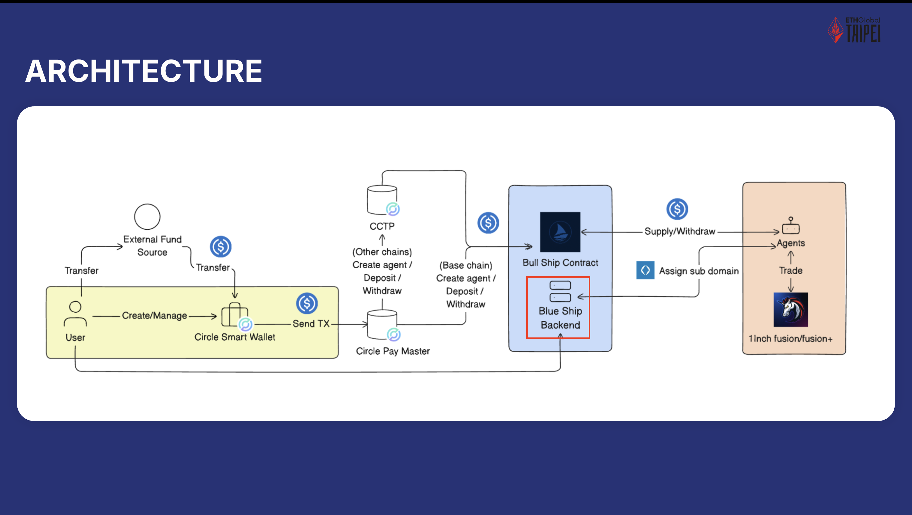

<p align="center">
  
</p>

<p align="center">An intent-driven AI trading agent platform that simplifies and enhances automated trading through seamless Web3 integration.</p>

## Getting started

```bash
$ npm install
```

## Compile and run the project

```bash
# development
$ npm run dev
```

## How it works
### 1. Onboarding
1. A user connects to the Bull Ship Agent platform via **PassKey** and completes **KYC** verification to comply with regulations.
2. The user deposits **USDC** from any major chain into their wallet.

### 2. Agent Creation
1. The user initiates the creation of a new trading agent by filling in the agent’s name, token list, and a plain-text description of the trading strategy (no code required).
2. The agent is registered via a smart contract. The user pays a transaction fee using **USDC**, not ETH.
3. Upon creation, the user funds the agent with USDC and receives **agent tokens**, representing their share in the agent’s pool.

### 3. Agent Trading Execution
1. Each agent has its own dedicated **on-chain wallet**, complete with an **ENS subname** for human-readable identity.
2. At each interval, the agent:
    - Consumes information
    - Forms a trading intent
    - Submits this intent without needing to choose which chain to use
3. The Bull Ship backend interprets the trading intent and searches for the best price across chains using **1inch Fusion and Fusion+**.
4. Trades are routed to the optimal venue, executed, and then the agent waits for the next interval.
5. At the end of each **epoch (~7 days)**, the agent:
    - Concludes its performance
    - Converts all assets back to USDC
    - Distributes returns to investors
    - Accepts new funding
6. Over time, the Bull Ship backend records performance metrics and aggregates data for investors to evaluate and invest in agents.

### 4. Investing in an AI Agent
1. Users browse and explore active agents on the platform.
2. Investors buy agent tokens using **USDC**. A **0.3% fee** is transferred to the agent’s creator.
3. The AI agent now has more capital to trade with.
4. Investors can **request withdrawals** at any time, with funds released at the end of the current epoch (~7 days).
5. For immediate liquidity, investors can **sell their agent tokens on a secondary market**.
6. Selling back to the pool also incurs a **0.3% fee**, which is sent to the agent creator. Investors receive a **proportional share** of the agent’s USDC balance based on their ownership.

## System Architecture



1. **Circle Smart Wallet**:
    
    Enables PassKey-based onboarding and KYC verification.
    
2. **Circle Paymaster**:
    
    Facilitates gasless transactions by allowing USDC to cover transaction fees.
    
3. **CCTP (Cross-Chain Transfer Protocol)**:
    
    Allows users to fund agents even if their USDC is held on chains outside of the Base chain (Bull Ship contracts operate on Base). CCTP hook is used to invoke agent registration transaction on chain.
    
4. **ENS L2 Subnames**:
    
    Each agent receives an L2 subname under `bullship.eth`, offering a clear and human-readable identity.
    
5. **1inch Portfolio**:
    
    Tracks agent assets across multiple chains, presenting a comprehensive and insightful dashboard of each agent’s holdings and performance.
    
6. **1inch Fusion & Fusion+**:
    
    The backbone of trade execution, providing the best rates across major chains and optimizing trade outcomes.
    
7. **Bull Ship Contract**:
    
    A central smart contract managing agent registration, share token issuance, and the co-investment system.
    
8. **Bull Ship Backend**:
    
    An off-chain relayer responsible for:
    
    - Invoking AI models
    - Tracking agent performance
    - Handling data queries for agents and users

## Relevant Repositories
1. Backend - https://github.com/SMC-Hack/bullship-agent-backend
2. Core Smart contract - https://github.com/SMC-Hack/bullship-agent-contract
3. ENS subname contract - https://github.com/SMC-Hack/bullship-agent-durin-contract